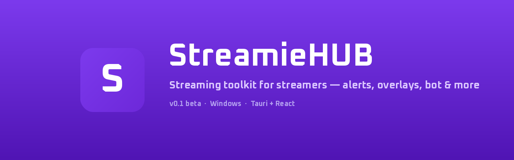
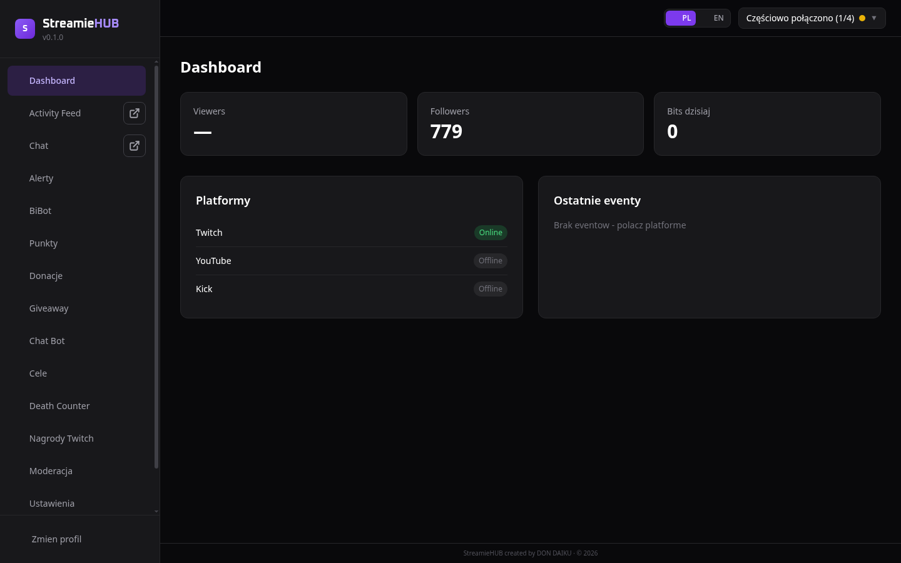

<p align="right">
  <a href="README.pl.md">🇵🇱 Polski</a>
</p>

<p align="center">
  
</p>

<h1 align="center">StreamieHUB</h1>

<p align="center">
  <strong>Lightweight desktop streaming toolkit for Twitch, YouTube & Kick</strong><br>
  Alerts, overlays, chat bot, channel points, giveaways, donations - all in one app.
</p>

<p align="center">
  <a href="https://github.com/dondaiku/StreamieHUB/releases/latest"></a>
  <a href="https://github.com/dondaiku/StreamieHUB/releases"></a>
  
  
</p>

---

## What is StreamieHUB?

StreamieHUB is a free, local desktop app for streamers - a lightweight alternative to StreamElements, Streamlabs, or Mix It Up. Everything runs on your PC, no browser tabs required.

<p align="center">
  
</p>

## Features

| Module | Description |
|--------|-------------|
| **Alerts** | Visual & audio notifications for follows, subs, bits, raids, donations |
| **Chat Bot** | Custom commands, timers, moderation - works on Twitch, YouTube & Kick |
| **BiBot** | Map bits/donations to actions - play sounds, trigger animations, press keys |
| **Channel Points** | Custom currency, shop, redemptions, leaderboard |
| **Giveaway** | Keyword entry, wheel spin, lottery - pick winners live on stream |
| **Death Counter** | Track and display game deaths on your overlay |
| **Overlays** | Alert box, chat, goals, event list - add as OBS Browser Source |
| **Donations** | Accept tips via Stripe with customizable donation page |

## Platforms

<p align="center">
  
  
  
</p>

- **Twitch** - EventSub (subs, bits, follows, raids) + chat via tmi.js
- **YouTube** - Live Streaming API (chat, Super Chats)
- **Kick** - WebSocket API (chat, events)

## Installation

1. Go to [**Releases**](https://github.com/dondaiku/StreamieHUB/releases/latest)
2. Download `StreamieHUB-Setup-x.x.x.exe`
3. Run the installer - that's it

> **Requirements:** Windows 10/11 with WebView2 (pre-installed on modern Windows).

## How overlays work

StreamieHUB runs a local server on your PC. Add overlays to OBS as Browser Sources:

```
http://localhost:3200/overlay/alerts
http://localhost:3200/overlay/chat
http://localhost:3200/overlay/goals
http://localhost:3200/overlay/deathcounter
http://localhost:3200/overlay/eventlist
http://localhost:3200/overlay/giveaway
```

All overlays update in real-time via Socket.IO - zero delay.

## Free vs Pro

StreamieHUB is **free to use** with generous limits. Power users can upgrade to **Pro** for unlimited everything.

| | Free | Pro |
|---|---|---|
| All modules | Yes | Yes |
| Custom commands | 20 | Unlimited |
| Active overlays | 3 | Unlimited |
| Custom alerts | 5 | Unlimited |
| Overlay watermark | Yes | No |
| Donation fee | 3% | 1% |
| Premium templates | - | Yes |
| Priority support | - | Yes |

## Feedback & Bug Reports

Found a bug? Have a feature idea? Open an [Issue](https://github.com/dondaiku/StreamieHUB/issues) or start a [Discussion](https://github.com/dondaiku/StreamieHUB/discussions).

## Author

Created by **DON DAIKU** - [Twitch](https://twitch.tv/dondaiku) | [Twitter/X](https://x.com/dondaiku)

---

<p align="center">
  <sub>StreamieHUB &copy; 2026 DON DAIKU. All rights reserved.</sub>
</p>
